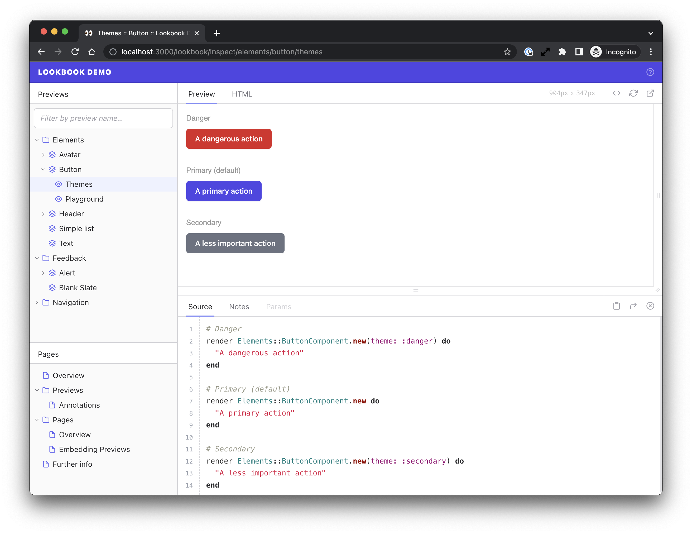

 
 

A tool to help browse, develop, test & document [ViewComponents](https://viewcomponent.org/) in Ruby on Rails apps.

 

## Documentation

✨ **Lookbook guide and API docs**: [lookbook.build](https://lookbook.build)

> _Looking for pre-v1.0 documentation? [Head over here](https://github.com/ViewComponent/lookbook/tree/0.9.x)._

## Demo

✨ **Online Demo**: [lookbook-demo-app.herokuapp.com/lookbook](https://lookbook-demo-app.herokuapp.com/lookbook)

✨ **Demo repo**: [github.com/ViewComponent/lookbook-demo](https://github.com/ViewComponent/lookbook-demo)

## Development

Lookbook is implemented as an isolated [Rails Engine](https://guides.rubyonrails.org/engines.html) and uses [ViewComponent](https://viewcomponent.org), [Tailwind](https://tailwindcss.com/) and [Alpine](https://alpinejs.dev/) for it's UI.

This repository contains:

* The Lookbook source code ([`/app`](https://github.com/ViewComponent/lookbook/tree/main/app), [`/lib`](https://github.com/ViewComponent/lookbook/tree/main/lib), [`/config`](https://github.com/ViewComponent/lookbook/tree/main/config), etc)
* A '[workbench](#workbench)' app used for Lookbook component development ([`/workbench`](https://github.com/ViewComponent/lookbook/tree/main/workbench)).
* The Lookbook [documentation site](#docs-site) source code and content ([`/docs`](https://github.com/ViewComponent/lookbook/tree/main/docs)).
* A [test suite](#testing) with a 'runable' dummy app ([`/spec`](https://github.com/ViewComponent/lookbook/tree/main/spec)).

### Workbench

To preview the Lookbook components within a Lookbook instance you can run the included `workbench` app:

1. Clone this repo
2. Install dependencies: `bundle install & npm install`
3. Start the app: `bin/workbench`
4. Visit http://localhost:4545/lookbook to view the Lookbook instance

The `workbench` app will be started in development mode and any changes to Lookbook's views or assets will immediately be reflected in the UI.

### Documentation site

The [Lookbook docs site](https://lookbook.build) is built using [Bridgetown](https://www.bridgetownrb.com/) and the source files can be found in the `./docs` directory.

To preview changes locally you can run a development version of the docs site:

1. Clone this repo
2. Install dependencies: `bundle install`
3. Start the app: `bin/docs`
4. Visit http://localhost:4000 

### Testing

Lookbook uses [RSpec](https://relishapp.com/rspec) for testing.

Tests can be run using the `rake spec` or `bundle exec rspec` commands.

The dummy app that the tests are being run against can be viewed by running the `bin/dummy` command and then browsing to http://localhost:9292/lookbook

## Contributing

Lookbook is an un-funded open source project and contributions of all types and sizes are most welcome!

Please take the time to read over the [Contributing](./CONTRIBUTING.md) guide before making your first contribution and if anything isn't clear then [start a discussion](https://github.com/ViewComponent/lookbook/discussions) and we will do our best to help you out.

## Contributors 

Lookbook was created by [Mark Perkins](https://github.com/allmarkedup) and continues to grow
&amp; improve thanks to the ideas, suggestions and hard work of all of [these excellent humans](https://github.com/ViewComponent/lookbook/graphs/contributors):
 
 

## License

The gem is available as open source under the terms of the [MIT License](https://opensource.org/licenses/MIT).