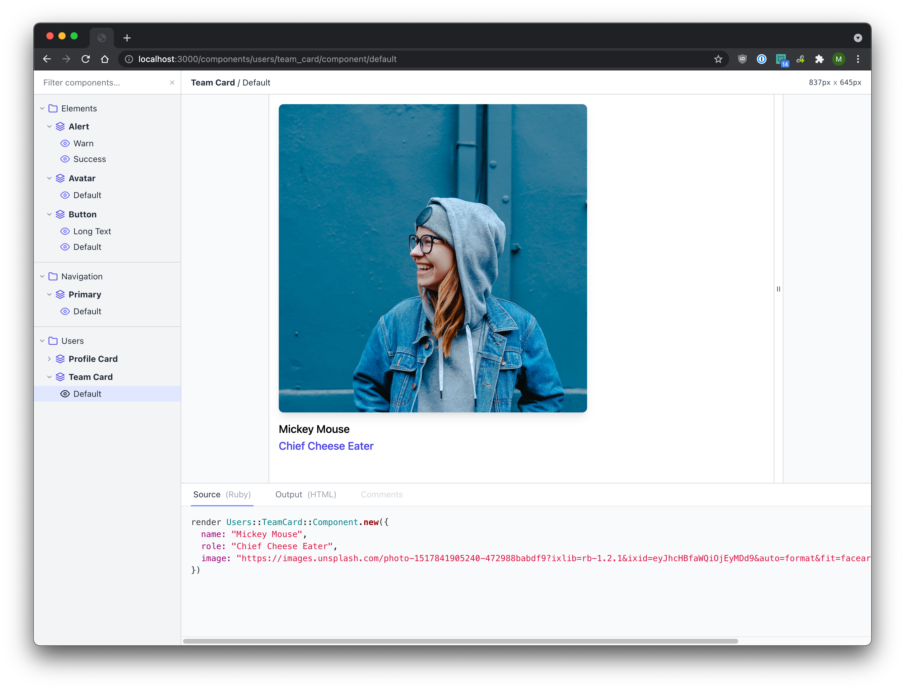
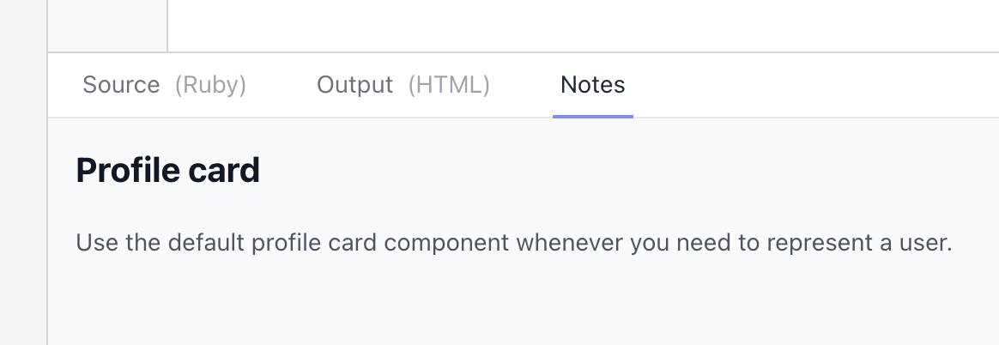

<div align="center">
<h1>👀 Lookbook 👀</h1>

<p>A native development UI for <a href="http://viewcomponent.org/">ViewComponent</a></p>

<div>
<a href="https://rubygems.org/gems/lookbook">
<a href="https://github.com/testdouble/standard">
<a href="https://github.com/prettier/prettier">
</div>
</div>

---

**Lookbook gives [ViewComponent](http://viewcomponent.org/)-based projects a _ready-to-go_ development UI for navigating, inspecting and interacting with component previews.**

It uses (and extends) the native [ViewComponent preview functionality](https://viewcomponent.org/guide/previews.html), so you don't need to learn a new DSL or create any extra files to get up and running.

Lookbook uses [RDoc/Yard-style comment tags](https://rubydoc.info/gems/yard/file/docs/Tags.md) to extend the capabilities of ViewComponent's previews whilst maintaining compatability with the standard preview class format, so you can add or remove Lookbook at any time without having to rework your code.



### Features

- Tree-style navigation menu
- Live nav search/filter
- Resizable preview window for responsive testing
- Highlighted preview source code and HTML output
- Add notes via comments in the preview file (markdown supported)
- Auto-updating UI when component or preview files are updated
- Supports 'hidden' previews and examples
- Works with standard the ViewComponent preview system

## Lookbook demo

If you want to have a quick play with Lookbook, the easiest way is to [give the demo app](https://github.com/allmarkedup/lookbook-demo) a spin. It's a basic Rails/ViewComponent app with a few test components included to tinker with.

The [demo app repo](https://github.com/allmarkedup/lookbook-demo) contains instructions on how to get it up and running.

## Installing

> ⚠️ **Please note:** Lookbook is still in the early stages of development and has not yet been well tested across a wide range of Rails/ViewComponent versions and setups. If you run into any problems please [open an issue](issues) with as much detail as possible. Thanks! ⚠️

### 1. Add as a dependency

Add Lookbook to your `Gemfile` somewhere **after** the ViewComponent gem. For example:

```ruby
gem "view_component", require: "view_component/engine"
gem "lookbook"
```

### 2. Mount the Lookbook engine

You then need to mount the Lookbook engine (at a path of your choosing) in your `routes.rb` file:

```ruby
Rails.application.routes.draw do
  if Rails.env.development?
    mount Lookbook::Engine, at: "/lookbook"
  end
end
```

The `at` property determines the root URL that the Lookbook UI will be served at.

> If you would like to expose the Lookbook UI in production as well as in development, just remove the `if Rails.env.development?` condition from around the mount statement.

Then you can start your app as normal and navigate to `http://localhost:3000/lookbook` (or whatever mount path you specified) to view your component previews in the Lookbook UI.

## Usage

You don't need to do anything special to see your ViewComponent previews and examples in Lookbook - just create them as normal and they'll automatically appear in the Lookbook UI. Preview templates, custom layouts and even bespoke [preview controllers](https://viewcomponent.org/guide/previews.html#configuring-preview-controller) should all work as you would expect.

> If you are new to ViewComponent development, checkout the ViewComponent [documentation](https://viewcomponent.org/guide/) on how to get started developing your components and [creating previews](https://viewcomponent.org/guide/previews.html).

### Annotating preview files

Lookbook parses [Yard-style comment tags](https://rubydoc.info/gems/yard/file/docs/Tags.md) in your preview classes to customise and extend the standard ViewComponent preview experience:

```ruby
# @label Basic Button
class ButtonComponentPreview < ViewComponent::Preview

  # Primary button
  # ---------------
  # This is the button style you should use for most things.
  #
  # @label Primary
  def default
    render ButtonComponent.new do
      "Click me"
    end
  end

  # Secondary button
  # ---------------
  # This should be used for less important actions.
  def secondary
    render ButtonComponent.new(style: :secondary) do
      "Click me"
    end
  end

  # Unicorn button
  # ---------------
  # This button style is still a **work in progress**.
  #
  # @hidden
  def secondary
    render ButtonComponent.new do
      "Click me"
    end
  end
end
```

**Tags** are just strings identified by their `@` prefix - for example `@hidden`. Tags are always placed in a comment above the relevant preview class or example method.

The following Lookbook-specific tags are available for use:

#### `@label <text>`

Used to replace the auto-generated navigation label for the item with `<text>`.

> Available for preview classes & example methods.

```ruby
# @label Preview Label
class FooComponentPreview < ViewComponent::Preview

  # @label Example Label
  def default
  end
end
```

#### `@hidden`

Used to temporarily exclude an item from the Lookbook navigation. The item will still be accessible via it's URL.

Can be useful when a component (or a variant of a component) is still in development and is not ready to be shared with the wider team.

> Available for both preview classes & example methods.

```ruby
# @hidden
class FooComponentPreview < ViewComponent::Preview

  # @hidden
  def default
  end
end
```

#### Adding notes

All comment text other than tags will be treated as markdown and rendered in the **Notes** panel for that example in the Lookbook UI.

```ruby
# @hidden
class ProfileCardComponentPreview < ViewComponent::Preview

  # Profile Card
  # ------------
  # Use the default profile card component whenever you need to represent a user.
  def default
  end
end
```



## Configuration

Lookbook will use the ViewComponent [configuration](https://viewcomponent.org/api.html#configuration) for your project to find and render your previews so you generally you won't need to configure anything separately.

However the following Lookbook-specific config options are also available:

### UI auto-refresh

Disable/enable the auto-updating of the Lookbook UI when files change. Enabled by default.

```ruby
config.lookbook.auto_refresh = false # default is true
```

By default Lookbook will listen for changes in any [preview directories](https://viewcomponent.org/api.html#preview_paths) as well as in the [components directory](config.view_component.preview_paths) itself.

If you wish to add additional paths to listen for changes in, you can use the `listen_paths` option:

```ruby
config.lookbook.listen_paths << Rails.root.join('app/other/directory')
```

## Contributing

Lookbook is very much a small hobby/side project at the moment. I'd love to hear from anyone who is interested in contributing but I'm terrible at replying to emails or messages, so don't be surprised if I take forever to get back to you. It's not personal 😜

### Developing on a local version of Lookbook

The quickest way to get a development version of Lookbook up and running is to use the [lookbook-demo](https://github.com/allmarkedup/lookbook-demo) app and link it to a local version of the Lookbook gem:

#### Initial setup:

1. Clone this repository somewhere on your machine - `git clone git@github.com:allmarkedup/lookbook.git`
2. Also pull down the [lookbook-demo](https://github.com/allmarkedup/lookbook-demo) repository to your machine
3. In the `Gemfile` of the `lookbook-demo` repository, replace `gem "lookbook", '>= 0.1', git: "https://github.com/allmarkedup/lookbook", branch: "main"` with `gem "lookbook", path: "../path/to/lookbook"` (use the path to your local copy of lookbook)
4. Install dependencies - from the root of the parent project run `bundle install`

#### Starting development

1. From within the `lookbook` root directory run the comand `npm run dev` (this will make sure the CSS/JS is recompiled if/when you make changes to the UI)
2. From within the `lookbook-demo` root directory run `npm run start` - this will start a server and build the demo assets

Point your browser to http://localhost:3000/lookbook to see the UI. You can then make and test changes to the Lookbook code in your local copy of lookbook repo. PRs are welcome if you add anything useful :-)

> Note that changes to files in the Lookbook `lib/` directory will require a server restart in order to have them applied.

#### Tests

You can run the tests from within the `lookbook` root directory with the `rake test` command.

## License

The gem is available as open source under the terms of the [MIT License](https://opensource.org/licenses/MIT).
