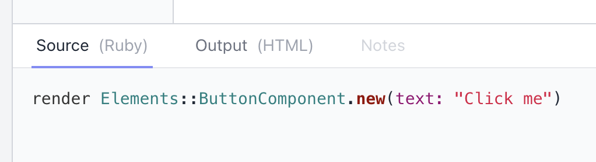
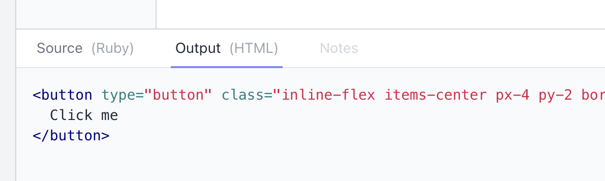
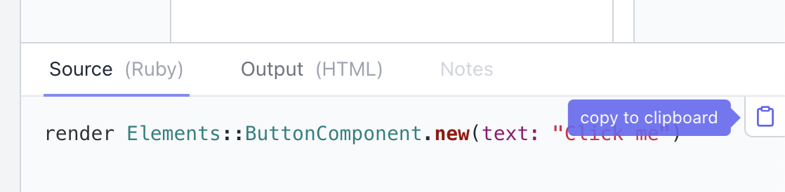

<div align="center">
<h2> L👀kbook</h2>

⚡️ Supercharge your [ViewComponent](http://viewcomponent.org/) development process 🚀

</div>

---

## About

Lookbook provides a _ready-to-go_ UI for navigating, inspecting and interacting with ViewComponent previews. It uses (and extends) ViewComponent's in-built [component preview functionality](https://viewcomponent.org/guide/previews.html) and is intended to integrate seamlessly with existing ViewComponent libraries.

The goal is to (eventually) give a [Storybook](https://storybook.js.org/)-like development experience for ViewComponents, but hopefully with a more 'Railsy' feel and without having to learn a whole new DSL.

> ⚠️ **PLEASE NOTE!** ⚠️
> Lookbook is very much a **work in progress** at the moment. There may be breaking changes on point-releases before a 1.0 version is ready.


### Current features

- 👀 Navigate your component previews with ease!
- 🔍 Filter/search previews by name
- 🖥 Resizable, responsive preview window
- 🔦 Highlighted preview source code (with one-click copy to clipboard)
- 🔦 Highlighted HTML output
- 📝 Add notes via comments in the preview file - markdown supported
- 🚀 Live UI, auto-updates when component or previews files are updated

### Future plans and ideas

Check out the [feature request issues](https://github.com/allmarkedup/lookbook/labels/feature%20request)) to get a feel for some of the potential features coming to Lookbook in the future. And please suggest your own if you have anything you'd like to see added!

## Lookbook demo

If you want to have a quick play with Lookbook, the easiest way is to [give the demo app](https://github.com/allmarkedup/lookbook-demo) a spin. It's a basic Rails/ViewComponent app with a few test components included to tinker with.

The [demo app repo](https://github.com/allmarkedup/lookbook-demo) contains instructions on how to get it up and running.

## Installing

Lookbook is current a work in progress and **has not been published as a Gem** yet.

If you wish to play with it in it's current state you can include it directly from Github using the instructions below.

### 1. Add as a dependency

In your `Gemfile` add:

```ruby
gem "lookbook", '>= 0.1', git: "https://github.com/allmarkedup/lookbook", branch: "main"
```

This line should be placed <strong>below</strong> wherever you have specified the `view_component` gem.

### 2. Mount the Lookbook engine

You then need to mount the Lookbook engine (at a path of your choosing) in your `routes.rb` file:

```ruby
Rails.application.routes.draw do
  # any other routes...
  if Rails.env.development?
    mount Lookbook::Engine, at: "/lookbook"
  end
end
```

The `at` property determines the root URL that the Lookbook UI will be served at.

> If you would like to expose the Lookbook UI in production as well as in development, just remove the `if Rails.env.development?` wrapper from the mount statement.

Then you can start your app as normal and navigate to `http://localhost:3000/lookbook` (or whatever mount path you specified) to view your component previews in the Lookbook UI.

## Usage

You don't need to do anything special to create ViewComponent previews for Lookbook.

Lookbook will use the [ViewComponent configuration options](https://viewcomponent.org/api.html#configuration) for your project to find and render your components so you don't need to configure anything separately (unless you want to tweak the behaviour or look of Lookbook itself).

> If you are new to ViewComponent development, checkout the [ViewComponent docs](https://viewcomponent.org/guide/) on how to get started developing your components.

Lookbook uses the exact same [preview files](https://viewcomponent.org/guide/previews.html) as 'regular' ViewComponent previews, so using preview templates, custom layouts and even bespoke [preview controllers](https://viewcomponent.org/guide/previews.html#configuring-preview-controller) should all work just the same.

Lookbook does however bring a few additions to the standard ViewComponent previews. That's why it exists!

### 🔦 Viewing source code and rendered HTML output

Lookbook displays the source code of the current preview (or the contents of preview template, if one is being used), right underneath the rendered preview itself:



You can also inspect the HTML output of the rendered preview (without any of the layout cruft):



All code panels have a 'copy-to-clipboard' button at the top right of the panel, just click it to copy the un-highlighted code to your clipboard.



### 📝 Adding notes to previews

Lookbook lets you add notes to your preview examples which are then displayed in the inspector panel. They look something like this:


Notes are generated from comments above example methods in your preview files. Below is an example of two preview examples that both have notes:

```ruby
# test/components/previews/button_component_preview.rb
class ButtonComponentPreview < ViewComponent::Preview

  # Add notes as comments above the example methods.
  # Multi-line is just fine and **markdown** is supported too!
  #
  # It's a good place to put usage and implementation instructions
  # for people browsing the component previews in the UI.
  def default
    render ButtonComponent.new(text: "Click me")
  end

  # Each preview example has it's own notes, extracted from the method comments.
  def danger
    render ButtonComponent.new(text: "Don't do it!", theme: :danger)
  end
end
```

## Configuration

Lookbook uses ViewComponent's configuration options for anything to do with previews, paths and general setup, so you won't need to duplicate any settings.

However the following Lookbook-specific config options are also available:

### UI auto-refresh

Disable/enable the auto-updating of the Lookbook UI when files change. Enabled by default.

```ruby
config.lookbook.auto_refresh = false # default is true
```

By default Lookbook will listen for changes in any [preview directories](https://viewcomponent.org/api.html#preview_paths) as well as in the [components directory](config.view_component.preview_paths) itself.

If you wish to add additional paths to listen for changes in, you can use the `listen_paths` option:

```ruby
config.lookbook.listen_paths << Rails.root.join('app/other/directory')
```

## Contributing

Lookbook is very much a small hobby/side project at the moment. I'd love to hear from anyone who is interested in contributing but I'm terrible at replying to emails or messages, so don't be surprised if I take forever to get back to you. It's not personal 😜

However, I'm a frontend developer - not a Rails dev - so any thoughts, advice or PRs on how to improve the codebase will be always much appreciated. 🍻

### Developing on a local version of Lookbook

The quickest way to get a development version of Lookbook up and running is to use the [lookbook-demo](https://github.com/allmarkedup/lookbook-demo) app and link it to a local version of the Lookbook gem:

#### Initial setup:

1. Clone this repository somewhere on your machine - `git clone git@github.com:allmarkedup/lookbook.git`
2. Also pull down the [lookbook-demo](https://github.com/allmarkedup/lookbook-demo) repository to your machine
3. In the `Gemfile` of the `lookbook-demo` repository, replace `gem "lookbook", '>= 0.1', git: "https://github.com/allmarkedup/lookbook", branch: "main"` with `gem "lookbook", path: "../path/to/lookbook"` (use the path to your local copy of lookbook)
4. Install dependencies - from the root of the parent project run `bundle install`

#### Starting development

1. From within the `lookbook` root directory run the comand `npm run dev` (this will make sure the CSS/JS is recompiled if/when you make changes to the UI)
2. From within the `lookbook-demo` root directory run `npm run start` - this will start a server and build the demo assets

Point your browser to http://localhost:3000/lookbook to see the UI. You can then make and test changes to the Lookbook code in your local copy of lookbook repo. PRs are welcome if you add anything useful :-)

> Note that changes to files in the Lookbook `lib/` directory will require a server restart in order to have them applied.

## License

The gem is available as open source under the terms of the [MIT License](https://opensource.org/licenses/MIT).
