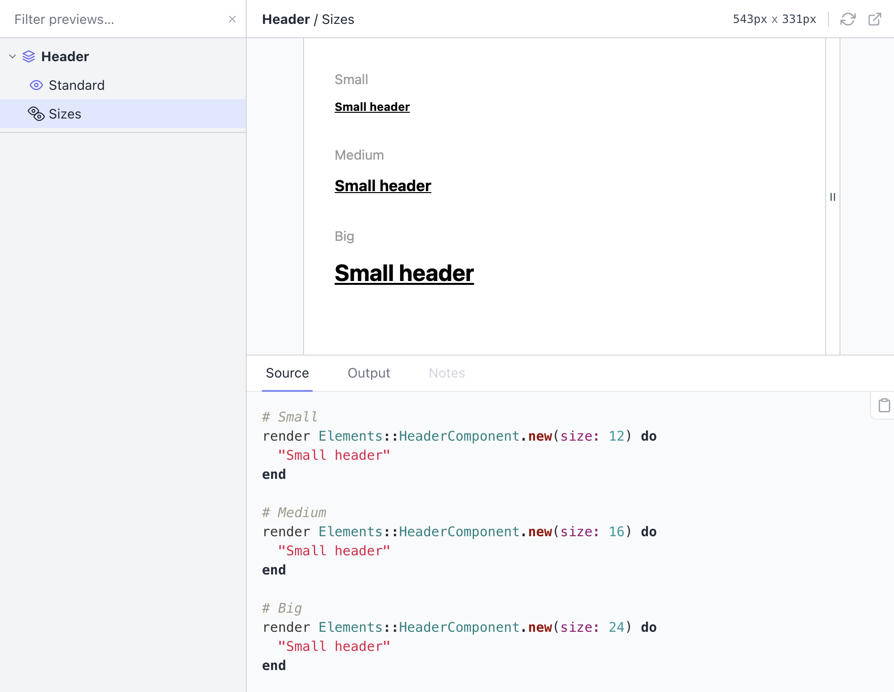

<div align="center">
<h1>👀 Lookbook 👀</h1>

<p>A native development UI for <a href="http://viewcomponent.org/">ViewComponent</a></p>

<div>
<a href="https://rubygems.org/gems/lookbook">
<a href="https://github.com/testdouble/standard">
<a href="https://github.com/prettier/prettier">
</div>
</div>

---

**Lookbook gives [ViewComponent](http://viewcomponent.org/)-based projects a _ready-to-go_ development UI for navigating, inspecting and interacting with component previews.**

It uses (and extends) the native [ViewComponent preview functionality](https://viewcomponent.org/guide/previews.html), so you don't need to learn a new DSL or create any extra files to get up and running.

Lookbook uses [RDoc/Yard-style comment tags](#annotating-preview-files) to extend the capabilities of ViewComponent's previews whilst maintaining compatability with the standard preview class format, so you can add or remove Lookbook at any time without having to rework your code.


### Features

- Tree-style navigation menu with live search/filter
- Resizable preview window for responsive testing
- Highlighted preview source code and HTML output
- Auto-updating UI when component or preview files are updated _(Rails v6.0+ only)_
- Use comment tag annotations for granular customisation of the preview experience
- Fully compatible with standard the ViewComponent preview system
- In-browser live-editable preview parameters (similar to basic Storybook Controls/Knobs)

## Lookbook demo

If you want to have a quick play with Lookbook, the easiest way is to [give the demo app](https://github.com/allmarkedup/lookbook-demo) a spin. It's a basic Rails/ViewComponent app with a few test components included to tinker with.

**Online demo: https://lookbook-demo-app.herokuapp.com/lookbook**

If you'd rather dig in a bit more and run the demo app locally, the [demo repo](https://github.com/allmarkedup/lookbook-demo) contains instructions on how to get it up and running.

## Installing

### 1. Add as a dependency

Add Lookbook to your `Gemfile` somewhere **after** the ViewComponent gem. For example:

```ruby
gem "view_component", require: "view_component/engine"
gem "lookbook"
```

### 2. Mount the Lookbook engine

You then need to mount the Lookbook engine (at a path of your choosing) in your `routes.rb` file:

```ruby
Rails.application.routes.draw do
  if Rails.env.development?
    mount Lookbook::Engine, at: "/lookbook"
  end
end
```

The `at` property determines the root URL that the Lookbook UI will be served at.

Then you can start your app as normal and navigate to `http://localhost:3000/lookbook` (or whatever mount path you specified) to view your component previews in the Lookbook UI.

#### Mounting in Production

If you would like to expose the Lookbook UI in production as well as in development

1. Remove the `if Rails.env.development?` condition from around the mount statement in `routes.rb`
2. Add `config.view_component.show_previews = true` to `config/environments/production.rb`


## Usage

You don't need to do anything special to see your ViewComponent previews and examples in Lookbook - just create them as normal and they'll automatically appear in the Lookbook UI. Preview templates, custom layouts and even bespoke [preview controllers](https://viewcomponent.org/guide/previews.html#configuring-preview-controller) should all work as you would expect.

> If you are new to ViewComponent development, checkout the ViewComponent [documentation](https://viewcomponent.org/guide/) on how to get started developing your components and [creating previews](https://viewcomponent.org/guide/previews.html).

## Annotating preview files

Lookbook parses [Yard-style comment tags](https://rubydoc.info/gems/yard/file/docs/Tags.md) in your preview classes to customise and extend the standard ViewComponent preview experience:

```ruby
# @label Basic Button
# @display bg_color "#fff"
class ButtonComponentPreview < ViewComponent::Preview

  # Primary button
  # ---------------
  # This is the button style you should use for most things.
  #
  # @label Primary
  def default
    render ButtonComponent.new do
      "Click me"
    end
  end

  # Button with icon
  # ----------------
  # This example uses dynamic preview parameters
  # which can be edited live in the Lookbook UI
  #
  # @param text
  # @param icon select [heart, cog, alert]
  def icon(text: "Spread the love", icon: "heart")
    render ButtonComponent.new(icon: icon) do
      text
    end
  end

  # Inverted button
  # ---------------
  # For light-on-dark screens
  #
  # @display bg_color "#000"
  def secondary
    render ButtonComponent.new(style: :inverted) do
      "Click me"
    end
  end

  # Unicorn button
  # ---------------
  # This button style is still a **work in progress**.
  #
  # @hidden
  def secondary
    render ButtonComponent.new do
      "Click me"
    end
  end

  # @!group More examples

  def short_text
    render ButtonComponent.new do
      "Go"
    end
  end

  def long_text
    render ButtonComponent.new do
      "Click here to do this thing because it's the best way to do it"
    end
  end

  def emoji_text
    render ButtonComponent.new do
      "👀📗"
    end
  end

  # @!endgroup

end
```

**Tags** are just strings identified by their `@` prefix - for example `@hidden`. Tags are always placed in a comment above the relevant preview class or example method.

The following Lookbook-specific tags are available for use:

* [`@label`](#label-tag)
* [`@display`](#display-tag)
* [`@!group ... @!endgroup`](#group-tag)
* [`@hidden`](#hidden-tag)
* [`@param`](#param-tag)

<h3 id="label-tag">🏷 @label</h3>

Used to replace the auto-generated navigation label for the item with `<text>`.

```ruby
@label <text>
```

> Available for preview classes & example methods.

```ruby
# @label Preview Label
class FooComponentPreview < ViewComponent::Preview

  # @label Example Label
  def default
  end
end
```

<h3 id="display-tag">🏷 @display</h3>

The `@display` tag lets you pass custom parameters to your preview layout so that the component preview can be customised on a per-example basis.

```ruby
# @display bg_color "#eee"
class FooComponentPreview < ViewComponent::Preview

  # @display max_width 500px
  # @display wrapper true
  def default
  end
end
```

The `@display` tag can be applied at the preview (class) or at the example (method) level, and takes the following format:

```ruby
@display <key> <value>
```

- `<key>` must be a valid Ruby hash key name, without quotes or spaces
- `<value>` will be parsed using the [Ruby YAML parser](https://yaml.org/YAML_for_ruby.html) to resolve the value

> Note: Ruby YAML does not (generally) require quoting of string values. However in some cases it _is_ required due to the presence of [indicator characters](https://yaml.org/YAML_for_ruby.html#indicators_in_strings) (such as `#`, `:` etc) - hence why the hex color code in the example above is surrounded by quotes. It's perfectly ok to quote all string values if you prefer.

These display parameters can then be accessed via the `params` hash in your preview layout using `params[:lookbook][:display][<key>]`:

```html
<!DOCTYPE html>
<html style="background-color: <%= params[:lookbook][:display][:bg_color] %>">
  <head>
    <title>Preview Layout</title>
  </head>
  <body>
    <div style="max-width: <%= params[:lookbook][:display][:max_width] || '100%' %>">
      <% if params[:lookbook][:display][:wrapper] == true %>
        <div class="wrapper"><%= yield %></div>
      <% else %>
        <%= yield %>
      <% end %>
    </div>
  </body>
</html>
```

> By default ViewComponent will use your default application layout for displaying the rendered example. However it's often better to create a seperate layout that you can customise and use specifically for previewing your components. See the  ViewComponent [preview docs](https://viewcomponent.org/guide/previews.html) for instructions on how to set that up.

Any `@display` params set at the preview (class) level with be merged with those set on individual example methods.

#### Global display params

Global (fallback) display params can be defined via a configuration option:

```ruby
# config/application.rb
config.lookbook.preview_display_params = {
  bg_color: "#fff",
  max_width: "100%"
}
```

Globally defined display params will be available to all previews. Any preview or example-level `@display` values with the same name will take precedence and override a globally-set one.

<h3 id="group-tag">🔖 `@!group ... @!endgroup`</h3>

For smaller components, it can often make sense to render a set of preview examples in a single window, rather than representing them as individual items in the navigation which can start to look a bit cluttered.

You can group a set of examples by wrapping them in `@!group <name>` / `@!endgroup` tags within your preview file:

```ruby
class HeaderComponentPreview < ViewComponent::Preview

  def standard
    render Elements::HeaderComponent.new do
      "Standard header"
    end
  end

  # @!group Sizes

  def small
    render Elements::HeaderComponent.new(size: 12) do
      "Small header"
    end
  end

  def medium
    render Elements::HeaderComponent.new(size: 16) do
      "Small header"
    end
  end

  def big
    render Elements::HeaderComponent.new(size: 24) do
      "Small header"
    end
  end

  # @!endgroup

end
```

The example above would display the `Sizes` examples grouped together on a single page, rather than as indiviual items in the navigation:



You can have as many groups as you like within a single preview class, but each example can only belong to one group.

<h3 id="hidden-tag">🏷 `@hidden`</h3>

Used to temporarily exclude an item from the Lookbook navigation. The item will still be accessible via it's URL.

Can be useful when a component (or a variant of a component) is still in development and is not ready to be shared with the wider team.

> Available for both preview classes & example methods.

```ruby
# @hidden
class FooComponentPreview < ViewComponent::Preview

  # @hidden
  def default
  end
end
```

<h3 id="param-tag">@param</h3>

The `@param` tag provides the ability to specify **editable preview parameters** which can be changed in the Lookbook UI in order to customise the rendered output on the fly, much like the [Controls (knobs) addon](https://storybook.js.org/addons/@storybook/addon-controls) for Storybook.

Each `@param` will have an associated form field generated for it. The values for each field will be handled as [dynamic preview params](https://viewcomponent.org/guide/previews.html#:~:text=It%E2%80%99s%20also%20possible%20to%20set%20dynamic%20values%20from%20the%20params%20by%20setting%20them%20as%20arguments%3A) when rendering the example.

The `@param` tag takes the following format:

```ruby
@param <name> <input_type> <opts?>
```

- `<name>` - name of the dynamic preview param
- `<input_type>` - input field type to generate in the UI
- `<opts?>` - YAML-encoded field options, used for some field types

#### Input types

The following **input field types** are available for use:

📝 **Text-style inputs** - Single line fields, useful for short strings of text or numbers.

```ruby
@param <name> text
@param <name> email
@param <name> number
@param <name> url
@param <name> tel
```

> The above types only differ in the validation constraints they impose on the input field.

📝 **Textarea** - Multi-line textarea field for longer-form content.

```ruby
@param <name> textarea
```

📝 **Select box** - Dropdown select field for selecting from a list of known options.

```ruby
@param <name> select <options>
```

`<options>` should be a [YAML array](https://yaml.org/YAML_for_ruby.html#simple_inline_array) of options which must be formatted in the same style as the input for Rails' [`options_for_select`](https://apidock.com/rails/v6.0.0/ActionView/Helpers/FormOptionsHelper/options_for_select) helper:

```ruby
# Basic options:
# @param theme select [primary, secondary, danger]

# With custom labels (each item itself an array of [label, value]):
# @param theme select [[Primary theme, primary], [Secondary theme, secondary], [Danger theme, danger]]

# With empty option (`~` in YAML)
# @param theme select [~, primary, secondary, danger]
```

> **Note**: In most cases YAML does not require quoting of strings, however if you are running into issues check out the [Ruby YAML docs](https://yaml.org/YAML_for_ruby.html) for a complete syntax reference.

📝 **Toggle** - On/off switch for toggling boolean values.

```ruby
@param <name> toggle
```

#### Default values

Default values are specified as part of the preview example method parameters in the usual Ruby way:

```ruby
def button(content: "Click me", theme: "primary", arrow: false)
  # ...
end
```

These will be used as the default values for the param fields.

> Note that the default values are **not** evaluated at runtime, so you cannot use method calls to generate the defaults. Only static default values are supported.

#### Type casting values

Most dynamic param values are passed to the example method as strings, with the following exceptions:

- `toggle` input - values are cast to booleans
- `number` input - values are cast to integers

In some cases, you may want to type cast the parameter value to something else (for example a `Symbol`) before using it when initializing the component.

To help with this, a `type` option can be specified in the `@param` definition to automatically cast the dynamic value to a different type:

```ruby
# @param <name> [<type>] <input_type> <opts?>
```

In the example below, the value of the `theme` param (by default a string) will be automatically cast to a Symbol, ready for use in instantiating the component.

```ruby
# @param theme [Symbol] select [primary, secondary, danger]
def default(theme: :primary)
  render Elements::ButtonComponent.new(theme: theme) do
    "Click me"
  end
end
```

The supported types to cast to are:

- `String` - *default for all except `toggle` inputs*
- `Boolean` - *default for `toggle` inputs*
- `Symbol`
- `Date`
- `DateTime`
- `Integer`
- `Float`

The following structured types are also available but should be considered **experimental** - you may run into bugs!

- `Hash` - *value string converted to Hash using the Ruby YAML parser*
- `Array` - *value string converted to Array using the Ruby YAML parser*

#### Full example:

```ruby
class ButtonComponentPreview < ViewComponent::Preview

  # The params defined below will be editable in the UI:
  #
  # @param content text
  # @param theme select [primary, secondary, danger]
  # @param arrow toggle
  def default(content: "Click me", theme: "primary", arrow: true)
    render Elements::ButtonComponent.new(theme: theme, arrow: arrow) do
      content
    end
  end

end
```


### Adding notes

All comment text other than tags will be treated as markdown and rendered in the **Notes** panel for that example in the Lookbook UI.

```ruby
# @hidden
class ProfileCardComponentPreview < ViewComponent::Preview

  # Profile Card
  # ------------
  # Use the default profile card component whenever you need to represent a user.
  def default
  end
end
```

## Configuration

Lookbook will use the ViewComponent [configuration](https://viewcomponent.org/api.html#configuration) for your project to find and render your previews so you generally you won't need to configure anything separately.

However the following Lookbook-specific config options are also available:

### UI auto-refresh

> ⚠️ UI auto-refresh is only supported in Rails v6.0+

Disable/enable the auto-updating of the Lookbook UI when files change. Enabled by default.

```ruby
config.lookbook.auto_refresh = false # default is true
```

By default Lookbook will listen for changes in any [preview directories](https://viewcomponent.org/api.html#preview_paths) as well as in the [components directory](config.view_component.preview_paths) itself.

If you wish to add additional paths to listen for changes in, you can use the `listen_paths` option:

```ruby
config.lookbook.listen_paths << Rails.root.join('app/other/directory')
```

### Custom favicon

If you want to change the favicon used by the Lookbook UI, you can provide a path to your own (or a data-uri string) using the `ui_favicon` option:

```ruby
config.lookbook.ui_favicon = "/path/to/my/favicon.png" 
```

> To disable the favicon entirely, set the value to `false`.


<h3 id="experimental-features">Experimental features opt-in</h3>

Some features may occasionally be released behind a 'experimental' feature flag while they are being tested and refined, to allow people to try them out and provide feedback.

> ⚠️ **Please note:** Experimental features should be considered to be **subject to extensive change** and breaking changes to them may be made within point releases - these features are **not** considered to be covered by [semver](https://semver.org/) whilst flagged as 'experimental'. ⚠️

#### Opting into specific features (recommended)

To opt into individual experimental features, include the name of the feature in the `experimental_features` config option:

```ruby
config.lookbook.experimental_features = ["feature_name"]
```

#### Opting into all experimental features (not recommended!)

If you want to live life on the bleeding-edge you can opt-in to all current **and future** experimental features (usual caveats apply):

```ruby
config.lookbook.experimental_features = true
```


## Keyboard shortcuts

Lookbook provides a few keyboard shortcuts to help you quickly move around the UI.

- `f` - move focus to the nav filter box
- `Esc` [when focus is in nav filter box] - Clear contents if text is present, or return focus to the UI if the box is already empty
- `s` - Switch to Source tab in the drawer
- `n` - Switch to Notes tab in the drawer
- `v` - Switch to the rendered preview
- `o` - Switch to the code preview
- `r` - Refresh the preview (useful if using something like Faker to generate randomised data for the preview)
- `w` - Open the standalone rendered preview in a new window

## Troubleshooting

#### Blank preview window

Certain setups (for example when using `Rack::LiveReload`) can cause an issue with the way that the preview iframe displays the rendered component preview (i.e. using the `srcdoc` attribute to avoid extra requests).

If you are seeing a blank preview window, but the source and output tabs are both displaying code as expected, you can disable the use of the `srcdoc` attribute using the following configuration option:

```ruby
config.lookbook.preview_srcdoc = false
```

## Contributing

Lookbook is very much a small hobby/side project at the moment. I'd love to hear from anyone who is interested in contributing but I'm terrible at replying to emails or messages, so don't be surprised if I take forever to get back to you. It's not personal 😜

### Developing on a local version of Lookbook

The quickest way to get a development version of Lookbook up and running is to use the [lookbook-demo](https://github.com/allmarkedup/lookbook-demo) app and link it to a local version of the Lookbook gem:

#### Initial setup:

1. Clone this repository somewhere on your machine - `git clone git@github.com:allmarkedup/lookbook.git`
2. Also pull down the [lookbook-demo](https://github.com/allmarkedup/lookbook-demo) repository to your machine
3. In the `Gemfile` of the `lookbook-demo` repository, replace `gem "lookbook", '>= 0.1', git: "https://github.com/allmarkedup/lookbook", branch: "main"` with `gem "lookbook", path: "../path/to/lookbook"` (use the path to your local copy of lookbook)
4. Install dependencies - from the root of the parent project run `bundle install`

#### Starting development

1. From within the `lookbook` root directory run the comand `npm run dev` (this will make sure the CSS/JS is recompiled if/when you make changes to the UI)
2. From within the `lookbook-demo` root directory run `npm run start` - this will start a server and build the demo assets

Point your browser to http://localhost:3000/lookbook to see the UI. You can then make and test changes to the Lookbook code in your local copy of lookbook repo. PRs are welcome if you add anything useful :-)

> Note that changes to files in the Lookbook `lib/` directory will require a server restart in order to have them applied.

#### Tests

You can run the tests from within the `lookbook` root directory with the `rake test` command.

## License

The gem is available as open source under the terms of the [MIT License](https://opensource.org/licenses/MIT).
