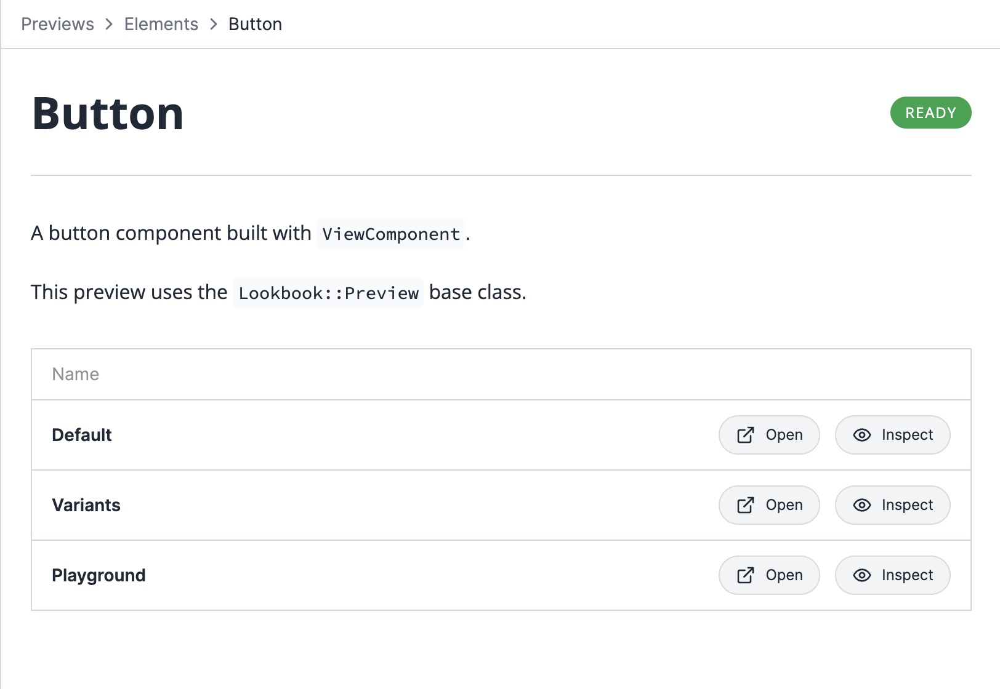

# Lookbook v3 alpha

### New features 

Below are details of some of the main new features that have been implemented so far in Lookbook v3. Give them a try and let us know what you think!

## 🆕 Preview overview pages

Preview overview pages are generated for each preview class and shown when clicking on the preview name in the navigation.

By default all overview pages use the same default template. This can be customised as required or replaced with a completely besoke, preview-specific page if needed.

#### Default template

> The layout and functionality of this template is still very much a work-in-progress and will likely change a lot before the final release.

The default template renders any class-level notes from the preview file as markdown text and inserts it at the top of the page.

After any text notes a list of scenarios is displayed with links to open in a new window or in the preview inspector.

[➡️ Demo example](https://v3-demo-app.lookbook.build/lookbook/previews/button)

```rb
# A button component built with [`ViewComponent`](https://viewcomponent.org).
#
# This preview uses the `Lookbook::Preview` base class.
#
# @status ready
class ButtonComponentPreview < Lookbook::Preview
  def default
    render Elements::ButtonComponent.new do
      "Default button"
    end
  end

  def variants
    # ...
  end

  def playground
    # ...
  end
end
```



#### Custom templates

Use the `preview_overview_template` config option to specify a custom template to use when rendering overview pages.

```rb
config.lookbook.preview_overview_template = "#{root}/views/path/to/custom_template"
```

A simple custom template to render any markdown notes and list out (and link to) the available previews might look something like this:

```erb
<h2>About<h2>

<%= markdown(preview.notes) %>

<h2>Scenarios<h2>

<ul>
  <% targets.each do |target| %>
    <li>
      <%= link_to target.label, target.url_path %>
    </li>
  <% end %>
</ul>
```

#### Preview-specific overview pages

Completely bespoke, preview-specific overview pages can be added by creating a markdown file alongside the preview class file. 

The markdown file should be called the same as the preview file but with a `.md` or `.md.erb` file extension instead of `.rb`:

```
test/components/previews/
├── button_component_preview.md.erb
└── button_component_preview.rb
```

These files are rendered as ERB templates and then run through the markdown parser in much the same was as [Lookbook pages](https://lookbook.build/guide/pages) are.

[➡️ Demo example](https://v3-demo-app.lookbook.build/lookbook/previews/heading)


## 🆕 Better nav customisation 

Lookbook v3 allows for more fine-grained control over the  display of items in the sidebar navigation, including the ability to relabel folders and override the default (alphabetical) order of items in the nav.

Config options for each folder can be specified in a `_config.yml` file within the target directory, including in the root previews/pages directory if required.

### Ordering child items

By default all items are ordered alphabetically in the navigation. This can be overridden in the `_config.yml` file by specifying an array of ordered child items names as the `children` property value:

```yml
# test/components/previews/_config.yml
children:
  - buttons
  - forms
  - alerts
  - navigation
  - emails
```

Each item in the array should match the name of a folder, preview or page that exists within that directory.

Sometimes you may just want to ensure that a number of specific items are displayed first, and then all of the rest after them. This can be done with the special `"*"` entry:

```yml
# test/components/previews/_config.yml
children:
  - buttons
  - forms
  - "*"
```

In the above case, the `buttons` and `forms` directories will always be the top items in the nav, and any other items within the directory will be listed below in the standard alphabetical order.

> Note that the `"*"` entry can be placed anywhere within the list, not just at the end.


### Customising folder display names

The nav display name of the folder containing the `_config.yml` file can be customised using the `label` option:

```
test/components/previews/
└── alerts/
    ├── _config.yml
    ├── toast_component_preview.rb
    └── banner_component_preview.rb
```

```yml
# test/components/previews/alerts/_config.yml
label: Feedback
```

In the example above the parent folder name would be displayed as `Feedback` instead of `Alerts` in the navigation.


## 🆕 ActionMailer previews

> ⚠️ ActionMailer preview support is still very much at an experimental stage. Any feedback and/or suggestions on this feature would be very welcome!

[➡️ Demo example](https://v3-demo-app.lookbook.build/lookbook/previews/user_mailer/welcome)

### Enabling ActionMailer preview support

Lookbook mailer previews are an experimental feature and must be enabled using the `experimental_features` config option:

```rb
config.lookbook.experimental_features << :mailer_previews
```

### Usage

The intention is to support standard ActionMailer previews are out-of-the-box in Lookbook v3, with no changes required to the regular [ActionMailer preview format](https://guides.rubyonrails.org/action_mailer_basics.html#previewing-emails):

```rb
class UserMailerPreview < ActionMailer::Preview
  def welcome_email
    UserMailer.with(name: "Bob").welcome_email
  end
end
```

Any existing mailer previews in your should automatically appear in the Lookbook UI.

Mailer previews can be located in the standard Rails mailer preview directory (`test/mailers/previews`) or if you prefer to keep things altogether they can be added into the main Lookbook previews directory.

All the usual Lookbook [tags/annotations](https://lookbook.build/guide/tags) (apart from `@!group` tags) can be used in ActionMailer previews in exactly the same way as in component previews:

```rb
class UserMailerPreview < ActionMailer::Preview
  # @label New user welcome
  def welcome_email
    UserMailer.with(name: "Bob").welcome_email
  end

  # This email is still WIP and not ready for use.
  # @hidden
  def experimental_email
    UserMailer.with(name: "Bob").experimental_email
  end
end
```

[Dynamic params](https://lookbook.build/guide/previews/params) work in the same way as component previews, as long as the param values are passed to the email template as instance variables:

```rb
class UserMailer < ApplicationMailer
  def welcome
    @name = params[:name]
    mail(to: "user@example.com", subject: "Welcome")
  end
end
```

```rb
class UserMailerPreview < ActionMailer::Preview
  # @param name
  def welcome_email(name: "Bob")
    UserMailer.with(name: name).welcome_email
  end
end
```

## Lots more!

More docs/info to come.


