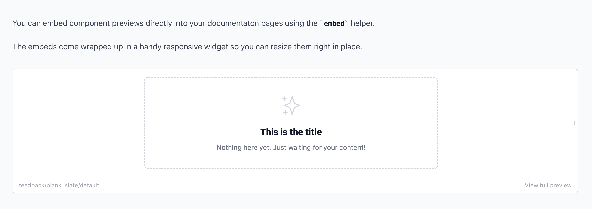

## Documentation Pages

If you need to add more long-form documentation to live alongside your component previews you can do so using Lookbook's markdown-powered `pages` system.

### Pages demo

For an example of some pages in Lookbook, check out the [example pages](https://lookbook-demo-app.herokuapp.com/lookbook) in the Lookbook demo app and the associated [page files](https://github.com/allmarkedup/lookbook-demo/tree/main/test/components/docs) in the demo repo.

### Usage

By default, pages should be placed in the `test/components/docs` directory (although this can be customised) and can be nested in directories as deeply as required.

Pages must have either a `.html.erb` or a `.md.erb` file extension. All pages are rendered as ERB templates but `.md.erb` files will also additionally be run through a markdown parser.

Pages can optionally make use of a **YAML frontmatter block** to customise the behaviour and content of the page itself.

An example page might look like this:

```markdown
---
title: An example page
label: Nice example
---

This is an example page. If it has a `.md.erb` file extension its
contents will be run through a Markdown parser/renderer before display.

Fenced code blocks are fully supported and will be highlighted appropriately.

ERB can be used in here.
The template will be rendered **before** being parsed as Markdown.

You can can access data about the page using the `@page` variable.
The title of this page is "<%= @page.title %>".
```

### YAML Frontmatter

Pages can use an optional YAML frontmatter block to configure the behaviour of the page and to provide custom data, if required.

The following page options can be customised via frontmatter:

- `id` - a custom page ID that can be used for linking to it from other pages
- `label` - The name of the page that will be displayed in the navigation (auto-generated from the file name if not set)
- `title` - The main page title displayed on the page (defaults to the label value if not set).
- `hidden` - If `false` the page will not appear in the navigation but will still be accessible at it's URL (useful for pages that are still in development) [default: `true`]
- `landing` - Set to `true` to use the page as the Lookbook landing page [default: `false`]
- `header` - Set to `false` to hide the page header containing the page title [default: `true`]
- `footer` - Set to `false` to hide the page footer containing the previous/next page links [default: `true`]
- `data` - Optional hash of custom data to make available for use in the page - see info on [page variables](#page-variables) below. [default: `{}`]

#### Frontmatter defaults

You can set global default values for page options in the application configuration:

```ruby
# config/application.rb
config.lookbook.page_options = {
  footer: false, data: { brand_colors: { red: '#ff0000' } }
}
```

These will be merged with any page-level frontmatter data. Options set in the frontmatter will override those set at the global level (apart from `data`, which will be deep-merged with the any globally defined data).

### Page variables

All pages have the following variables available for use in the page template:

- `@page` - The current page object
- `@next_page` - The next page object (if available)
- `@previous_page` - The previous page object (if available)
- `@pages` - Collection of all pages

Page objects have access to frontmatter variables:

```ruby
The page title is <%= @page.title %>

Our brand color hex value is <%= @page.data[:brand_colors][:red] %>
```

### Ordering pages and directories

If you want to enforce a specific order for pages and directories in the Lookbook navigation you can prefix the file/directory basename with an 'order number' integer value followed by an underscore or hyphen.

For example: `01_example_page.md.erb` will be displayed first in the navigation (`01`) within the directory it is in.

The integer value will be parsed out from the filename so that it doesn't appear in navigation labels or URLs, and the value itself will be used as a 'position' number when sorting the navigation items.

For example, an ordered directory of pages might look like:

```
test/components/docs/
  ├── 01_overview.md.erb
  ├── 02_implementation_notes/
  │   ├── 01_slots.md.erb
  │   └── 02_html_attributes.md.erb
  └── 03_helpful_examples/
      ├── 01_basic_components.md.erb
      └── 02_complex_components.md.erb
```

Without the number prefixes on the file names the pages may not have appeared in the navigation in the desired order.

### Linking to other pages

You can get the path to a page using the `page_path` helper. This accepts a page `id` (as a `Symbol`) or a page object:

```markdown
Visit the [about page](<%= page_path :about %>)

Go to the [next page](<%= page_path @next_page %>)
```

Page ids can be set in the YAML frontmatter block for that page:

```
---
id: about
---

This is the about page.
```

### Embedding previews

You can embed preview examples from your project directly into the documentation pages using the `embed` helper, which renders an iframe with the rendered preview in it at any point in your document.

The output looks like this:



To specify which preview example to render, the helper accepts a preview class and a method name (as a symbol), like this:

```erb
<%= embed Elements:ButtonComponentPreview, :default %>
```

#### Preview params

If you have configured your examples to accept preview params (see the [`@param`](#param-tag) docs), then you can supply values for those params when rendering the embedded preview:

```erb
<%= embed Elements:ButtonComponentPreview, :default, params: {
  icon: "plus",
  text: "Add new"
} %>
```

### Displaying code

You can use language-scoped [fenced code blocks](https://www.markdownguide.org/extended-syntax/#fenced-code-blocks) in the markdown file to render nicely highlighted code examples.

However, if you are not using Markdown, or need a little more control, you can use the `code` helper instead:

```erb
<%= code do %>
  # code goes here
<% end %>
```

The default language is `ruby`. To highlight a different language you need to specify it's name as an argument:

```erb
<%= code :html do %>
  <!-- code goes here -->
<% end %>
```

> Lookbook uses [Rouge](https://github.com/rouge-ruby/rouge) for syntax highlighting. You can find a [full list of supported languages here](https://github.com/rouge-ruby/rouge/blob/master/docs/Languages.md).


### Tabs

It's possible to break up your page's content into multiple files and have the content from each file rendered as a set of tabs on the main page.

Tab page files should have the same name as the parent page, but with a suffix of `[insert-tab-name-here]` before the file extension.

For instance, in the example below, the `avatar` page will have 3 tabs ('design', 'mobile' & 'web') rendered below any content in the main avatar page.

```
test/components/docs/
  ├── 01_avatar.md.erb
  ├── 01_avatar[design].md.erb
  ├── 01_avatar[mobile].md.erb
  ├── 01_avatar[web].md.erb
```

> Tabs can contain embedded previews, code examples and can contain frontmatter, just like in regular pages.

By declaring the `label` frontmatter you can change the label shown on the tab:

```
---
label: Website
---
```

If you want the tabs in a different order, you can use the `position` frontmatter:

```
---
label: Website
position: 1
---
```

---

### Pages configuration

These options can be set in your application configuration files to customise the pages behaviour.

#### `page_paths`

An array of directories to look for pages in.
Default: `["test/previews/docs"]`

```ruby
config.lookbook.page_paths = %w[path/to/my/pages]
```

#### `page_route`

The URL segment used to prefix page routes.
Default: `pages`

```ruby
config.lookbook.page_route = `docs`
```

---

**Next:** [Configuration &rarr;](configuration.md)